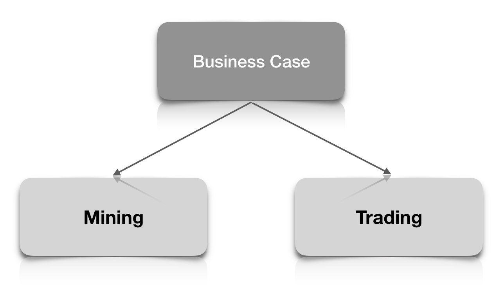

<!-- .slide: data-background="./img/city-blured-night.jpg" -->
## The Innovation Lab

---
<!-- .slide: data-background="./img/city-blured-2.jpg" -->
A few things about

# CRYPTO

---
<!-- .slide: data-background="./img/city-blured-2.jpg" -->
### What is it actually good for? 

---
<!-- .slide: data-background="./img/city-blured-2.jpg" -->
### Investment

---
<!-- .slide: data-background="./img/city-blured-2.jpg" -->
### Trading: What's good?

* Can be traded without leverage
* Frequent fluctulations
* Examples of extreme growth
* New currencies

---
<!-- .slide: data-background="./img/city-blured-2.jpg" -->

### Trading: What's not so good?

* Not regulated
* Reliability of coins and tokens
* Reliability of exchanges

---
<!-- .slide: data-background="./img/city-blured-2.jpg" -->
### Trading: Where to start?

* USD 100
* Larger exchanges (BitFinex, HitBTC, Kraken)
* Blogs, tutorials, podcasts
* Tame your expectations

---
<!-- .slide: data-background="./img/city-blured-2.jpg" -->
And most importantly...

# HAVE FUN!

---
<!-- .slide: data-background="./img/city-blured-night.jpg" -->
## The Innovation Lab

